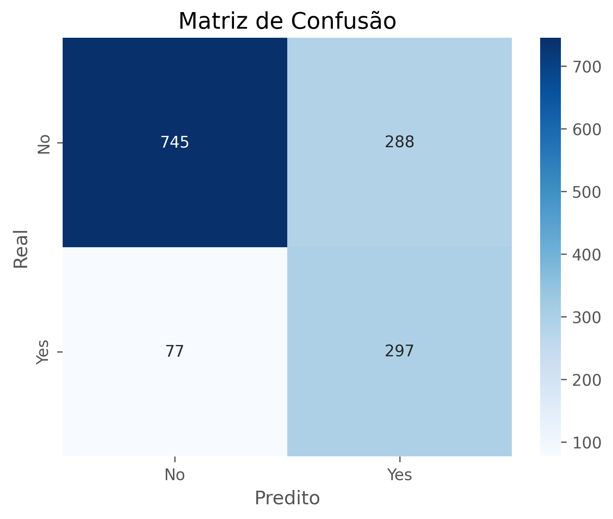

# Análise de churn de clientes

Este projeto tem como objetivo analisar o comportamento dos clientes de uma empresa de telecomunicações e prever quais deles têm maior propensão a cancelar os serviços contratados (churn).

## Sobre o Projeto
- Objetivo: Desenvolver uma análise exploratória aprofundada e construir um modelo preditivo para identificar clientes com maior probabilidade de churn.
- Dataset: Telco Customer Churn.
- Técnicas utilizadas: análise exploratória (EDA), visualizações com gráficos, engenharia de atributos, treinamento de modelos de machine learning.

## Tecnologias e Bibliotecas Utilizadas
- Python (Pandas, NumPy, Matplotlib, Seaborn, Scikit-learn, imblearn)
- Git e GitHub

## Análise exploratória (EDA)
Durante a EDA, foram respondidas perguntas de negócio como:

1. Qual a proporção de clientes que deram churn?
Análise da taxa de churn em relação ao total de clientes.

2. Como os gastos mensais variam entre clientes que deram churn e os que não deram?
Comparação da distribuição de gastos com foco em diferenças entre os grupos.

3. Qual a distribuição da variável tenure entre os grupos de churn?
Análise do tempo de permanência na empresa e sua relação com o churn.

4. Como questões familiares impactam o churn?
Avaliação da proporção de churn entre clientes com e sem parceiros/dependentes.

5. Existe interação entre gênero e presença de parceiro no churn?
Mapa de calor para analisar o churn em 4 combinações possíveis de gênero e presença de parceiro.

6. Quais são as maiores correlações entre variáveis numéricas?
Geração de heatmap de correlação e análise das 5 maiores correlações absolutas usando o coeficiente de Pearson.

## Modelagem preditiva
Para a etapa de modelagem, o foco foi construir um classificador que conseguisse prever com o máximo de assertividade os clientes com risco de churn. No o processo foi monitorado todos experimentos via MLflow, o que permitiu registrar métricas, hiperparâmetros, artefatos e comparações entre diferentes abordagens de forma organizada e rastreável.

Testes Iniciais (Testes 1 a 4):
- Modelos testados: Árvore de Decisão e SVC.
- Codificações testadas: standardscaler, OrdinalEncoder e OneHotEncoder.
- Resultado: As métricas foram baixas, com F1-score em torno de 0.50~0.56. A mudança de codificador não teve impacto significativo. O SVC teve leve melhora na acurácia, mas ainda com recall abaixo de 0.50.

Introdução da random forest (Testes 5 a 7):
- Modelo: RandomForestClassifier com hiperparâmetros padrão.
- Resultado: Leve melhoria no F1-score (~0.53), mas ainda com recall em torno de 0.48.

Tunagem de Hiperparâmetros com GridSearchCV (Testes 8 a 11):
- Testei tunagem de parâmetros para Árvore de Decisão, SVC e Random Forest, ajustando também o parâmetro scoring para otimizar recall.
- Melhor resultado dessa fase: Árvore de Decisão tunada (Teste 8), com recall = 0.59 e f1-score = 0.61, mantendo uma boa acurácia (0.79).

Aplicando Oversampling com SMOTE (Testes 12 a 14):
- Para lidar com o desequilíbrio da variável alvo, utilizei o SMOTE para balancear a base.
- Os modelos foram treinados novamente com GridSearchCV e foco em recall.

Modelo Final com XGBoost (Teste 15)
Após testes com modelos clássicos, explorei a utilização do XGBoost (XGBClassifier), buscando melhorias de performance e capacidade de generalização.

Modelo: XGBClassifier
Pré-processamento: StandardScaler + OneHotEncoder
Balanceamento: SMOTE na base de treino
Tunagem: GridSearchCV com otimização voltada para o recall
Monitoramento: Executado com MLflow
Métricas Finais:
  - Precision: 0.50
  - Recall: 0.76
  - F1-score: 0.61
  - Acurácia: 0.78

## Interface de Previsão
Para facilitar o uso prático do modelo, desenvolvi uma interface web com Streamlit, integrando uma API criada com FastAPI:

## Matriz de confusão

